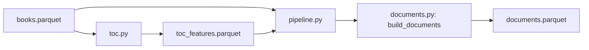

# Architecture

The current pipeline prepares text from saved local files. It does not call a
model or rank books yet.

`bigquery.py` handles explicit downloads. `local_data.py` reads and saves local
Parquet files; missing files never cause a download. The raw snapshot is kept
unchanged.

`toc.py` builds one inspection row per original TOC item, including empty items
and review flags. `documents.py` is a pure transformation: it selects nonblank
TOC text and one book-level text per book, preferring Amazon features and using
description as a fallback. It keeps source identifiers and performs no file IO.

`pipeline.py` coordinates local reads, source checks, transformation, and saving.
It verifies the saved TOC against its raw snapshot and the current TOC code,
records both input checksums, and writes a new document file through
`local_data.py`. Existing outputs and both inputs are protected from overwrite.

Notebooks inspect the saved artifacts and compare them with the package code.
Notebook 05 is the review point for the document table. Tests use invented
records and temporary files, with no external services.

The next stage will turn documents into model-sized passages and vectors,
preserving document and book IDs. Book ranking and its evaluation remain
separate from text preparation. Dataset rules and observed totals are in
[data.md](data.md).
