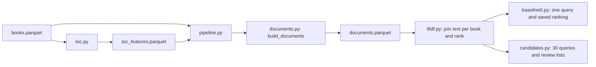

# Architecture

The preparation pipeline builds traceable text from saved local files.
A separate TF-IDF baseline now ranks books, and candidate collection supplies
books for human relevance judgments. Quality metrics are still unmeasured.

`bigquery.py` handles explicit downloads. `local_data.py` reads and saves local
Parquet files; missing files never cause a download. The raw snapshot is kept
unchanged.

`toc.py` builds one inspection row per original TOC item, including empty items
and review flags. `documents.py` is a pure transformation: it selects nonblank
TOC text and one book-level text per book, preferring Amazon features and using
description as a fallback. It keeps source identifiers and performs no file IO.

`pipeline.py` coordinates local reads, source checks, transformation, and saving.
It verifies the saved TOC against its raw snapshot and the current TOC code,
records both input checksums, and writes a new document file through
`local_data.py`. Existing outputs and both inputs are protected from overwrite.

Notebooks inspect the saved artifacts and compare them with the package code.
Notebook 05 is the review point for the document table. Tests use invented
records and temporary files, with no external services.

`tfidf.py` fits default TF-IDF weights on catalog text and ranks books by cosine
similarity. `baseline0.py` and `candidates.py` coordinate local inputs, output
protection, and recorded configurations/checksums. Neither assigns relevance
grades. Notebook 06 checks the baseline; notebook 07 shows candidate evidence.

The next task is a five-query labeling pilot, followed by a shared candidate
pool and versioned judgments. Evaluation remains separate from inference and
text preparation. Model-sized passages and embeddings can follow this baseline.
Dataset rules and observed totals are in [data.md](data.md); the evaluation
contract is in [metrics.md](metrics.md), with sources in [references.md](references.md).

The GitHub Actions [test workflow](../.github/workflows/tests.yml) installs
locked dependencies and runs offline tests. It does not download the catalog,
execute data-dependent notebooks, or measure recommendation quality.
